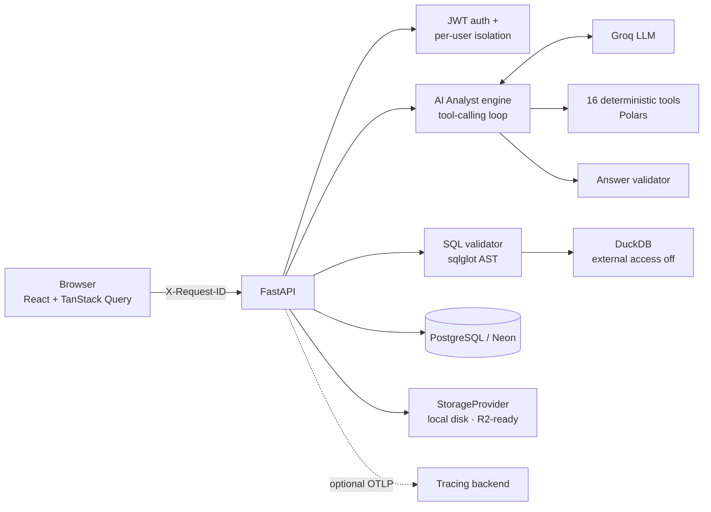

# PulseIQ

**Upload a spreadsheet, ask it questions in plain English, and get answers
whose every number was computed by real code — then checked — not
guessed by a language model.**

**Live demo:** [pulseiq-frontend-production.up.railway.app](https://pulseiq-frontend-production.up.railway.app)
— log in with `demo@pulseiq.dev` / `TryPulseIQ-9220`. A sample e-commerce
dataset (full of deliberate data-quality problems) and a dashboard are
already loaded. Try *"Find the most important anomalies in this
dataset."*

> The demo account is shared and has a daily AI budget; if it's used up,
> the page says so and when it resets. It's rebuilt automatically on every
> deploy.

## What it does

- **AI Analyst** — ask a question; the model decides which of 16 analytical
  tools to run against the *full* dataset (not a sample), and every
  finding it reports is cross-checked against those tools' real output
  before it reaches you. The page shows which tools ran and which findings
  were verified.
- **Natural language → SQL** and a **SQL Explorer**, both behind a real
  SQL validator (security-audited — see below).
- **Dataset explorer** — filter, group, and aggregate without writing a query.
- **Dashboards**, **saved insights**, **anomaly monitors**, **query history**.
- **Usage page** — today's AI requests, tokens, and remaining daily budget.

## Architecture



One request carries one id end to end: the browser sends `X-Request-ID`,
every backend log line (down to each tool call and LLM call) carries it,
and — when tracing is enabled — so does the root span of its trace.

## Key engineering decisions

**The model never computes a number.** A language model is good at
choosing *which* analysis answers a question and bad at arithmetic it
can't check. So the model only picks tools; 16 deterministic tools (Polars,
plus DuckDB for formula checks) compute everything, and an answer
validator checks every reported finding's numbers against the tools'
actual output. A finding that can't be
matched is **shown and flagged**, not hidden — hiding it would make the
validator pointless to the user.
([`docs/AI_ANALYTICS.md`](docs/AI_ANALYTICS.md))

**NL-to-SQL is kept safe by construction, then attacked to prove it.**
Generated SQL is parsed into a real syntax tree (`sqlglot`) and must be a
single `SELECT` over the user's own dataset, with only known columns,
standard SQL functions, and a clamped row limit; DuckDB then runs with
external file/network access disabled as an independent second layer.
Attacking the validator with real payloads found **2 genuine bypasses**
the original tests had missed — bare function calls like `version()`
executed, and an oversized `LIMIT` skipped the row cap — both fixed and
regression-tested. ([`docs/SECURITY.md`](docs/SECURITY.md))

**Rate limits are handled, not just retried.** Retries back off with full
jitter and honor the provider's own suggested wait — but cap it at 8
seconds, because a request can't hang for the 18m50s Groq actually
suggested once its daily quota ran out. Repeated questions are answered
from a cache; per-user daily token budgets stop one user from spending
the whole account's quota; and tokens and latency are recorded per
request from the provider's own usage data.
([`docs/AI_ANALYTICS.md`](docs/AI_ANALYTICS.md))

## Evaluation

A 51-question harness ([`evals/`](evals/)) over two generated datasets
covers all 16 tools, NL-to-SQL, and multi-step questions, with ground
truth computed by the app's own tools — never by the model.

**Honest status:** the full live run hasn't completed. It stopped at
question 27 on Groq's free-tier limit of 200,000 tokens per day. What
*has* been measured:

| Measurement | Result | Source |
|---|---|---|
| Live questions answered before the daily cap | 26 of 27 attempted | first full run's log |
| Tokens per `/analyze` question (spot check, n=3) | 3,227 – 6,651 | [`evals/results/smoke_2026-09-25.json`](evals/results/smoke_2026-09-25.json) + one console run |
| Tokens for a repeated question | 0 (served from cache) | tests |

Full numbers land in [`docs/EVALS.md`](docs/EVALS.md) once a complete run
finishes — none will be estimated in the meantime.

## Engineering quality

- **316** backend tests and **24** frontend tests; ruff, mypy, tsc, and
  oxlint clean.
- CI on every pull request: backend, frontend, the eval harness's
  deterministic checks, and Docker image builds.
- **19** bugs tracked with root cause, fix, and verification in
  [`docs/BUGS.md`](docs/BUGS.md) — several found by running the real app
  rather than reading the code — one (BUG-017) only by inspecting a live
  trace.

## Tech stack

| Layer | Tech |
|---|---|
| Backend | FastAPI, SQLAlchemy + Alembic, PostgreSQL (Neon), JWT auth |
| Analytics | Polars (tools and structured queries), DuckDB (validated SQL and formula checks) |
| AI | Groq, behind a provider abstraction; off unless `AI_PROVIDER=groq` |
| Observability | structlog JSON logs with request ids; optional OpenTelemetry (OTLP) |
| Frontend | React 19, Vite, TypeScript, Tailwind CSS v4, TanStack Query, ECharts, Vitest |
| Deploy | Railway (both services, from `main`), Docker |

## Run it locally

```bash
cp .env.example .env              # set DATABASE_URL (any Postgres) and SECRET_KEY

# backend
cd backend
python -m venv .venv && source .venv/bin/activate
pip install -r requirements-dev.txt
alembic upgrade head
uvicorn app.main:app --reload     # http://localhost:8000 (API docs at /docs)

# frontend, separate terminal
cd frontend && npm install && npm run dev   # http://localhost:5173
```

AI features need `AI_PROVIDER=groq` and a `GROQ_API_KEY`. Or run both
services with `docker compose up --build`. Every setting is documented in
[`.env.example`](.env.example).

## Tests

```bash
cd backend && pytest && ruff check . && mypy app   # needs a local Postgres in DATABASE_URL
cd frontend && npm test && npm run typecheck && npm run lint
cd evals && python -m pytest                      # harness tests; live runs: see evals/README.md
```

## Documentation

| Doc | Covers |
|---|---|
| [`ARCHITECTURE.md`](docs/ARCHITECTURE.md) | System design and the two query pipelines |
| [`AI_ANALYTICS.md`](docs/AI_ANALYTICS.md) | The AI Analyst, caching, quotas, cost, and measured token usage |
| [`SECURITY.md`](docs/SECURITY.md) | The security model, including the NL-to-SQL audit |
| [`EVALS.md`](docs/EVALS.md) | The evaluation harness: method, and results as they exist |
| [`DEPLOYMENT.md`](docs/DEPLOYMENT.md) | The Railway deploy, what's verified on the platform and what isn't |
| [`BUGS.md`](docs/BUGS.md) | Every bug found: root cause, fix, verification |
| [`STORAGE.md`](docs/STORAGE.md) | The storage abstraction and the R2 path |
| [`TESTING.md`](docs/TESTING.md) | Test suites and verified end-to-end flows |
| [`PHASES.md`](docs/PHASES.md) · [`PROGRESS.md`](docs/PROGRESS.md) | The build plan and the dated build log |
| [`LEARNING.md`](docs/LEARNING.md) | Design rationale per step, and interview questions |
| [`RESUME.md`](docs/RESUME.md) | Resume bullets and a 30-second pitch |
